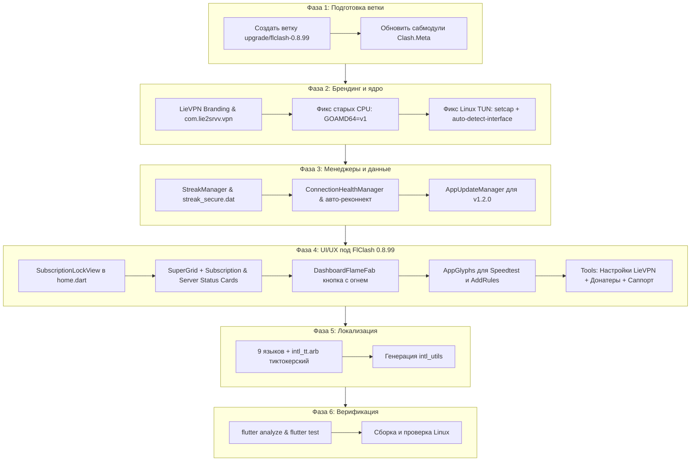

# Детальный план обновления LieVPN на базе FlClash v0.8.99

> **Цель**: Полный перенос и адаптация LieVPN на свежую кодовую базу FlClash v0.8.99 с сохранением всех уникальных функций LieVPN (стрики, тиктокерский язык, личный кабинет, автоапдейтер), решением проблемы с маршрутизацией трафика всего ПК на Linux (TUN на старых процессорах) и обеспечением бесшовного обновления пользователей.

---

## 1. Текущий статус бэкапа (Готово и проверено)
1. **Git ветка и тег в репозитории**:
   - `backup/lievpn-v1.1.0` (отправлен в `origin`)
   - `backup-lievpn-v1.1.0` (отправлен в `origin`)
2. **Локальный Git Bundle**:
   - `/home/lie2srvv/Документы/VIBECODING/FLCLASH_BACKUPS/LieVPN_repo_backup_2026-10-05_v1.1.0.bundle` (65 МБ)
3. **Полный физический архив рабочей директории**:
   - `/home/lie2srvv/Документы/VIBECODING/FLCLASH_BACKUPS/LieVPN_working_tree_2026-10-05_v1.1.0.tar.gz` (2.3 ГБ)
4. **Удаленный апстрим FlClash**:
   - Подключен: `upstream https://github.com/chen08209/FlClash.git`
   - Тег `v0.8.99` получен (`68c71b8ef9b7486a224972eb371ff153c6b2de0f`).

---

## 2. Анализ специфики LieVPN и ключевых задач

### A. Тиктокерский язык (TikTok / Memes ⚡)
- В LieVPN локаль `tt` используется как язык «TikTok / Memes ⚡» с мемным сленгом зумеров и сигм («Главный Вайб», «Засейвить и затащить», «Подрубить LieVPN (моггинг он)», «Потушить LieVPN (ушел в тильт)», «Чиназес сюдааа», «Скуф», «Попустить в утиль»).
- В проекте есть скрипты генерации и обогащения: `scripts/translate_tt.py` и `scripts/enrich_tt.py`.
- **Задача**: Сохранить `intl_tt.arb` и скрипты, обогатить тиктокерский словарь новыми ключами из FlClash 0.8.99 (карточки дашборда, сервисы, глифы, настройки DNS-логов).

### B. Сохранение серий (Streaks) и данных пользователей без потерь
- Стрик-система (`StreakManager`) хранит данные в:
  1. `appPath.homeDirPath/streak_secure.dat` (зашифрованный крипто-хэшем файл с защитой от накрутки системного времени).
  2. SharedPreferences: `lie_sec_ds` (obfuscated device salt).
  3. Состояние подписки и активного профиля (`activeSubscriptionProfileProvider`).
- **Гарантия**: При миграции имя пакета (`com.lie2srvv.vpn`), схема базы данных и путь хранения `appPath.homeDirPath` остаются неизменными. Все серии, дни, восстановления и токены сохранятся на 100%.

### C. Проблема на Linux: «Внутри приложения пингует, а весь ПК не через VPN»
- **Диагностика первопричины**:
  1. **TUN mode отключен по умолчанию на десктопе**: В `clash_config.dart` у `Tun` значение `@Default(false) bool enable`. На мобилках стартует Android `VpnService` (перехватывает всё), а на Linux без явного включения TUN стартовал только локальный HTTP/SOCKS5 прокси (`127.0.0.1:7890`). Внутри приложения пинг и чекер IP шли через локальный прокси (поэтому приложение показывало «в сети» и зеленый IP), но приложения системы (браузер, игры, терминал) не были настроены на прокси и шли мимо VPN!
  2. **Отказ авторизации TUN (`AuthorizeCode.error`)**: Попытка запустить весь GUI как root через `pkexec` на Wayland или старых дистрибутивах без `xhost` завершается ошибкой, и `_getEffectiveTunEnable` принудительно выставляет `enable: false`.
  3. **Отсутствие `auto-detect-interface: true` в конфиге TUN**: Без этого флага Clash.Meta на Linux не может автоматически определить физический интерфейс (`eth0`/`wlan0`) для маршрутизации трафика и исключения петель маршрутов.
  4. **Совместимость ядер и процессоров**: Для старых CPU `GOAMD64=v1` компилирует ядро без AVX2/FMA, но ядру Clash.Meta нужны сетевые права (`CAP_NET_ADMIN`, `CAP_NET_BIND_SERVICE`).
- **Решение**:
  - На десктопе (Linux) при старте VPN по умолчанию активировать TUN-режим.
  - Добавить в `clash_config.dart` поддержку `auto-detect-interface: true` и `dns-hijack: ['any:53']` для Linux.
  - Реализовать установку `setcap cap_net_admin,cap_net_bind_service=+ep` на бинарник ядра (`appPath.corePath`) через `pkexec`, что позволяет запускать ядро с сетевыми возможностями напрямую без запуска всего Flutter GUI от root!
  - Обеспечить авто-переключение сетевого стека `gvisor` / `system`.

### D. Бесшовный автоапдейтер
- Файл `version.json` на сервере обновлений:
  - Проверка версий с интервалом в 1 минуту и дедупликацией.
  - Скачивание пакетов для Windows (`.exe`), Linux (`.AppImage`, `.deb`), Android (`.apk`).
- Новая версия LieVPN будет `v1.2.0` (базируется на FlClash v0.8.99).

---

## 3. Фазы реализации

### Фаза 1. Ветка миграции и сабмодули
1. Создать локальную ветку `upgrade/flclash-0.8.99` от апстрим-тега `v0.8.99`.
2. Синхронизировать сабмодули `core/Clash.Meta`.

### Фаза 2. Платформа, идентификация и фикс Linux TUN
1. **Брендинг и пакеты**:
   - `pubspec.yaml`: `version: 1.2.0+2014`, имя `fl_clash` (внутреннее для совместимости с кодом) / `LieVPN`.
   - Android: `applicationId "com.lie2srvv.vpn"`, монохромная и адаптивная иконка, имя `LieVPN`.
   - Linux: `LieVPN` binary name, desktop entry, AppImage, deb config.
   - Windows: `Runner.rc`, `app_icon.ico`.
2. **Фикс Linux CPU и маршрутизации**:
   - `plugins/setup/setup_hooks/lib/src/go_builder.dart`: удержание `GOAMD64=v1`.
   - `setup.dart`: удержание скрипта зачистки `.note.gnu.property` через `objcopy`.
   - `lib/models/clash_config.dart`:
     - Добавить в `Tun` поля `@JsonKey(name: 'auto-detect-interface') @Default(true) bool autoDetectInterface`.
     - На Linux и Windows включить `tun.enable = true` по умолчанию при старте VPN.
   - `lib/common/system.dart`:
     - Настройка прав ядра Linux: выполнять `setcap cap_net_admin,cap_net_bind_service=+ep` на исполняемый файл ядра `appPath.corePath` через `pkexec`, что гарантирует работу TUN без запуска всего графического интерфейса под root.

### Фаза 3. Менеджеры и сохранение серий (Streaks)
1. Перенести `lib/manager/streak_manager.dart`:
   - Защита от накрутки через сетевое время `clck.lie2srvv.com`.
   - Поддержка файла `$homePath/streak_secure.dat`.
   - Логика восстановления сгоревших серий.
2. Перенести `lib/manager/connection_health_manager.dart` (авто-восстановление соединения).
3. Перенести `lib/common/app_update_manager.dart` с поддержкой бесшовного обновления на `v1.2.0`.
4. Перенести `lib/common/subscription_reminder.dart`.

### Фаза 4. Адаптация UI под архитектуру FlClash 0.8.99
1. **Экран блокировки подписки (`SubscriptionLockView`)**:
   - Встроить проверку подписки в `lib/pages/home.dart` перед загрузкой шелла приложения.
2. **Дашборд (`lib/views/dashboard/dashboard.dart`)**:
   - Интегрировать `SubscriptionStatusCard` и `ServerStatusCard` в начало `CustomScrollView` дашборда с сохранением дизайн-токенов (`AppCorner.xl`).
   - Заменить `StartButton` на `DashboardFlameFab` (плавающая кнопка с динамическим огнем и стрик-счетчиком).
3. **Навигация и глифы (`lib/views/navigation.dart`)**:
   - В FlClash 0.8.99 навигация перешла на векторные `Glyph`.
   - Создать глифы для `PageLabel.speedtest` (спидометр) и `PageLabel.addRules` (маршрутизация).
   - Оставить скрытыми ненужные вкладки `profiles` и `resources` (так как в LieVPN управление идет через Личный кабинет).
4. **Инструменты и модалки (`lib/views/tools.dart`)**:
   - Перенести `PersonalAccountModal`.
   - Перенести `SpeedtestView` и `SpeedtestService`.
   - Перенести `ServerStatusView` и `ServerStatusModal`.
   - Перенести `AddRulesView`.
   - Перенести пункты «Настройки LieVPN», «Донатеры (Зал славы)», шторку связи («Поддержка LieVPN»: Telegram, MAX, Email).
5. **Экран «О программе» (`lib/views/about.dart`)**:
   - Кастомизация LieVPN, ссылка на репозиторий форка, копирайты автора.

### Фаза 5. Локализация и тиктокерский язык
1. Обновить `arb/intl_tt.arb` и перенести тиктокерские скрипты `scripts/translate_tt.py` и `scripts/enrich_tt.py`.
2. Перенести полную локализацию на 9 языках (`ru`, `en`, `uk`, `be`, `kk`, `tt`, `ko`, `ja`, `zh_CN`).
3. Добавить тиктокерские переводы для новых терминов FlClash 0.8.99.
4. Выполнить компиляцию арб-файлов в dart-код через генератор локализации.

### Фаза 6. Тестирование, аудит и сборка
1. Запуск `flutter pub get`.
2. Проверка кода через `flutter analyze`.
3. Запуск существующих тестов (`flutter test`).
4. Пробная сборка Linux для подтверждения работоспособности.
